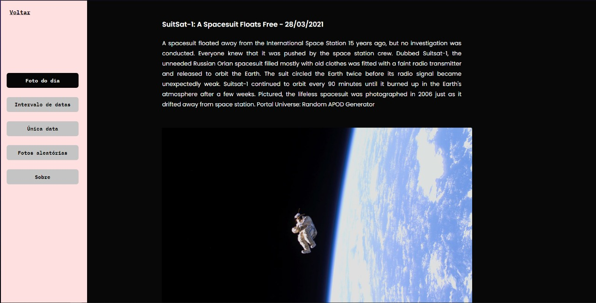

<p align="center">
  
  
  <a href="https://github.com/AntonioGally/Nasa_APIs/commits/master">
    
  </a>
   
   <a href="https://github.com/AntonioGally/Nasa_APIs/stargazers">
    
  </a>
  <a href="https://rocketseat.com.br">
    
  </a>
</p>

<h1 align="center">
    
</h1>

<h4 align="center"> 
	🚧  Nasa API's ☄️🛰️👨‍🚀 em construção  🚧
</h4>

<p align="center">
 <a href="#-sobre-o-projeto">Sobre</a> •
 <a href="#-funcionalidades">Funcionalidades</a> •
 <a href="#-layout">Layout</a> • 
 <a href="#-como-executar-o-projeto">Como executar</a> • 
 <a href="#-tecnologias">Tecnologias</a> • 
 <a href="#-autor">Autor</a> • 
</p>

## 💻 Sobre o projeto

🛰️ Nasa API's - é uma plataforma que tem como o objetivo usar algumas das API's fornecidas pela NASA para extrair dados interessantes sobre o universo.

---

## ⚙️ Funcionalidades

- [x] APOD

  - [x] Gerar uma imagem por dia de algo relacionado ao universo
  - [x] Gerar várias imagens que foram fotografadas em um intervalo de datas
  - [x] Gerar imagens aleatórias

- [x] NeoWs

  - [x] Procuar por informações de asteróides que estão perto da Terra
  - [x] Pesquisar Asteróides específicos que já estiveram próximo à Terra

- [x] DONKI

  - [x] Gerar informações sobre o clima do espaço em tempo real
  - [x] Gerar dados analíticos sobre observações climáticas de um determinado intervalo de datas
  - [x] Pesquisar por anomalias climáticas

---

## 🎨 Layout

O layout da aplicação está disponível no Figma:

<a href="https://www.figma.com/file/MMKtNOctGGbu8C5Kxa4JFo/Untitled?node-id=46%3A123">
  
</a>

### Prints

<p align="center" style="display: flex; align-items: flex-start; justify-content: center;">
  
    
</p>
<p align="center" style="display: flex; align-items: flex-start; justify-content: center;">
  
</p>

---

## 🚀 Como executar o projeto

### Pré-requisitos

Antes de começar, você vai precisar ter instalado em sua máquina as seguintes ferramentas:
[Git](https://git-scm.com), [Node.js](https://nodejs.org/en/).
Além disto é bom ter um editor para trabalhar com o código como [VSCode](https://code.visualstudio.com/)

#### 🧭 Rodando a aplicação web (Frontend)

```bash

# Clone este repositório
$ git clone https://github.com/AntonioGally/Nasa_APIs.git

# Acesse a pasta do projeto no seu terminal/cmd
$ cd Nasa_APIs

# Instale as dependências
$ yarn install

# Crie um arquivo dentro do diretório src com o nome MyKey.ts
$ ./src/MyKey.ts

# Adicione sua chave de API quem pode ser gerada em https://api.nasa.gov
$ export default function MyKey() {
    return "DEMO_KEY";
};


# Execute a aplicação em modo de desenvolvimento
$ yarn start

# A aplicação será aberta na porta:3000 - acesse http://localhost:3000

```

## 🛠 Tecnologias

As seguintes ferramentas foram usadas na construção do projeto:

#### **Website** ([React](https://reactjs.org/) + [TypeScript](https://www.typescriptlang.org/))

- **[React Router Dom](https://github.com/ReactTraining/react-router/tree/master/packages/react-router-dom)**
- **[Axios](https://github.com/axios/axios)**
- **[React Bootstrap](https://react-bootstrap.github.io)**
- **[Styled Components](https://styled-components.com)**
- **[Styled Icons](https://styled-icons.js.org)**
- **[Framer Motion](https://www.framer.com/motion/)**
- **[React Form Hook](https://react-hook-form.com)**
- **[React Scroll](https://www.npmjs.com/package/react-scroll)**
- **[TS Particles](https://particles.js.org)**

> Veja o arquivo [package.json](https://github.com/AntonioGally/Nasa_APIs/blob/main/package.json)

## 💪 Como contribuir para o projeto

1. Faça um **fork** do projeto.
2. Crie uma nova branch com as suas alterações: `git checkout -b my-feature`
3. Salve as alterações e crie uma mensagem de commit contando o que você fez: `git commit -m "feature: My new feature"`
4. Envie as suas alterações: `git push origin my-feature`

---

## 🦸 Autor

<a href="https://www.antoniogally.tk/#/">
 
 <br />
 <br />

---
